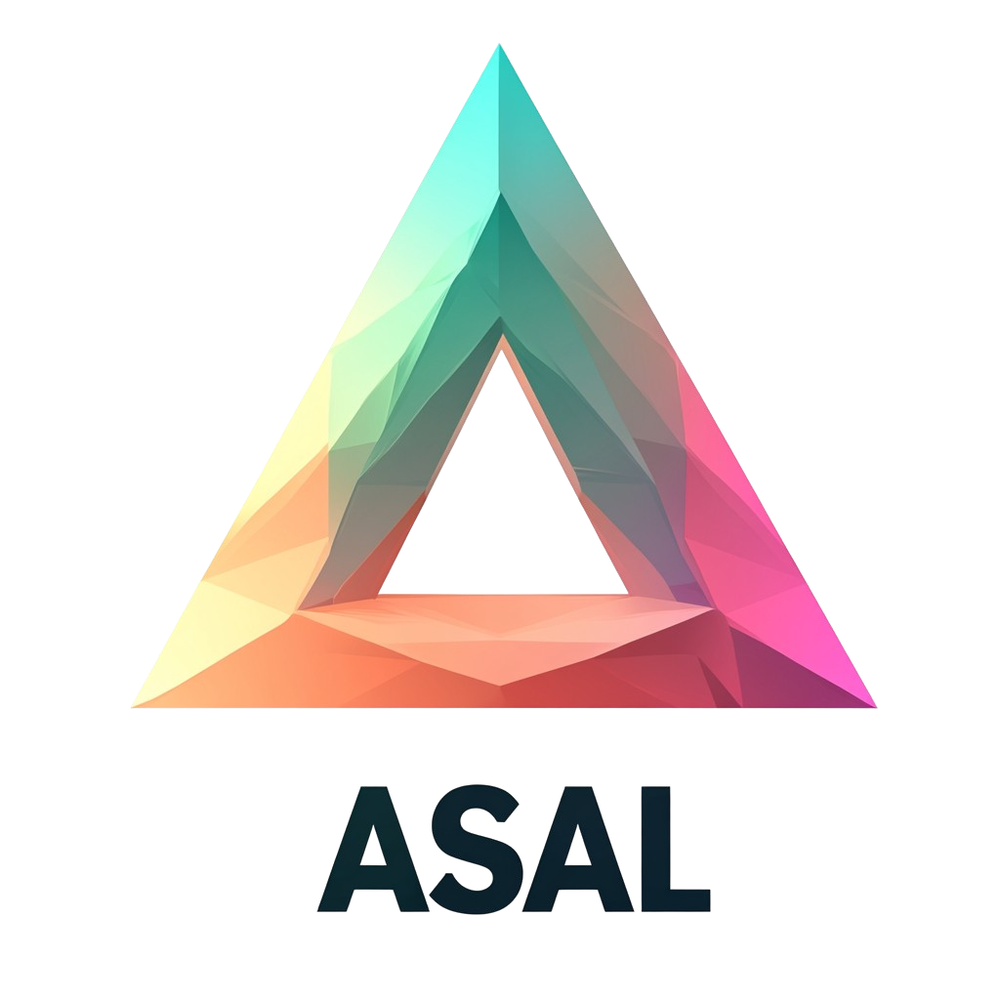

<h1 align="center">
  <br>
</h1>

<h1 align="center">
ASAL: Artificial Life Simulation Accelerated by Foundation Models
</h1>

<p align="center">
  🌐 <a href="https://github.com/AsalLabs-eng/ASAL-Models-Deploy">[GitHub]</a> |
  📄 <a href="https://x.com/asalsolana">[Twitter]</a>
</p>

## About ASAL

ASAL is an innovative project that combines artificial life simulation with foundation models, with future plans to integrate with Solana blockchain. Our goal is to accelerate artificial life research through automated discovery and optimization of complex systems.

## Key Features

- Automated parameter optimization for ALife simulations
- Integration with foundation models for enhanced discovery
- Support for multiple simulation substrates
- Future blockchain integration planned on Solana

## Supported Simulation Models

We have implemented several artificial life simulation models:

- Lenia
- Boids
- Particle Life
- Particle Life++
- Particle Lenia  
- Discrete Neural Cellular Automata
- Continuous Neural Cellular Automata
- Game of Life/Life-Like Cellular Automata

You can find these models in the [models/](models/) directory.

## Main Components

The main files to run ASAL are:
- `main_opt.py` - For supervised target and open-endedness optimization
- `main_illuminate.py` - For illumination using genetic algorithms
- `main_sweep_gol.py` - For Game of Life parameter space exploration

## Installation

```sh
git clone https://github.com/AsalLabs-eng/ASAL-Models-Deploy.git
cd ASAL-Labs

# Create conda environment
conda create --name asal python=3.10.13
conda activate asal

# Install dependencies
pip install -r requirements.txt
```

For GPU acceleration, please [manually install JAX](https://github.com/google/jax#installation) according to your system's CUDA version.

## Deployment

### Local Development
```sh
# Run simulation locally
python main_opt.py --sim boids --save_dir results
```

### Cloud Deployment
We recommend using cloud GPU instances for large-scale simulations:

1. **Cloud Setup**
```sh
# Install on cloud instance
git clone https://github.com/AsalLabs-eng/ASAL-Models-Deploy.git
cd ASAL-Labs
./scripts/setup_cloud.sh
```

2. **Docker Deployment**
```sh
# Build Docker image
docker build -t asal .

# Run container
docker run -it --gpus all asal
```

3. **Kubernetes Deployment**
```sh
# Deploy to k8s cluster
kubectl apply -f k8s/deployment.yaml
```

### Monitoring
- Use Prometheus + Grafana for metrics
- Monitor GPU utilization and simulation progress
- Track optimization convergence

### Production Tips
- Use environment variables for configuration
- Enable logging for debugging
- Set up automated backups
- Configure proper security measures

## Future Development

We plan to integrate ASAL with Solana blockchain to enable:
- Decentralized computation networks
- On-chain simulation parameter storage
- Community-driven model discovery
- Token incentives for computation sharing

## Contributing

We welcome contributions! Please see our [contributing guidelines](CONTRIBUTING.md) for details.

## License

This project is licensed under the Apache License 2.0 - see the [LICENSE](LICENSE) file for details.

## Team

ASAL is developed by a team of researchers and engineers passionate about artificial life, foundation models and blockchain technology.

## Citation

```bibtex
@article{asal2024,
  title={ASAL: Artificial Life Simulation Accelerated by Foundation Models},
  author={Power by Sakana.ai},
  year={2024},
  url={https://github.com/AsalLabs-eng/ASAL-Models-Deploy}
}
```


